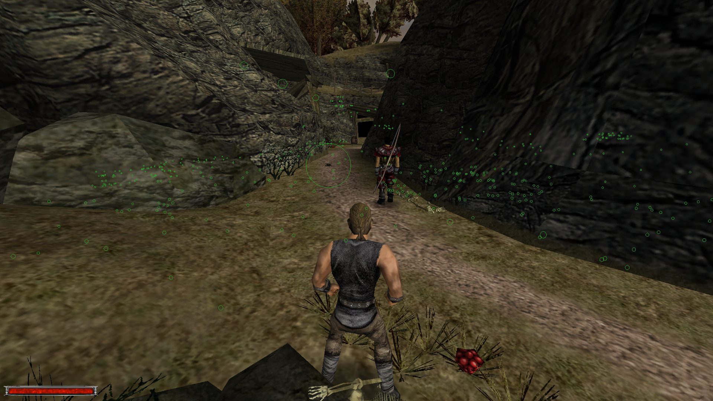
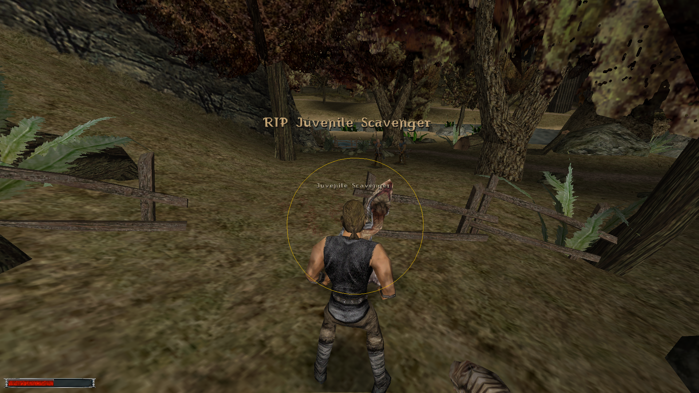

# Features
### TLDR Version
### No NPC can hide their XP from you now!

### No NPC will steal your XP quietly ever again!


# Death Alerts: 
Shows a text alert when NPC dies so hero misses out XP (by the following rules):
- NPC got killed by non-party member NPC and XP haven't been claimed yet (or `considerG1DoubleXPGlitch=1`);
- NPC got killed by game scripts (B_KillNpc/B_RemoveNpc) and player **could** have beaten them but haven't, which is: 
    - NPC haven't got immortality flag before getting killed/removed;
    - NPC death wasn't scripted in a way that player couldn't have done anything about it. For example: 
        - Carristo's death in Gothic 1 CH4 is ignored, however death of other fire magicians won't; 
        - Stone guardians killed next to the Jharkendar portal on our first arrival in G2 NotR should be ignored, however deaths of any remaining stone guardians on Raven defeat won't; 
    
        A lot of G2 NotR deaths cannot be detected in any other way than by than maintaing a curated list of such NPCs. In case the provided list is incorrect or non-exhaustive, it can be overriden by providing a custom filter. Game reads a line of text from a file located at `deadOnArrivalNPCListPath` (default `system\deadOnArrivalNPCList.txt`) which is parsed as a semicolon separated & **terminated** list of NPC instance names (basically what you'd type in `insert` console command/cheat to spawn given npc);
    - [`considerG1DoubleXPGlitch=1` only] Player or party member killed NPC with melee finisher;
    - [`considerG1DoubleXPGlitch=1` only] Player or party member killed NPC without beating them up first;
    - [`considerLevelZeroNPC=0`] Level 0 NPCs are ignored;

# XP NPC Locator: 
Draws spheres (circles really) around all NPCs around the current zCWorld who hero can still beat up to squeeze more XP. 
- Filters out NPCs with immortality flag set;
- Takes `considerG1DoubleXPGlitch` into account (uses different color if NPC was/wasn't beaten up);
- Takes `considerLevelZeroNPC` into account;
    
     **Warning**: framerate will suffer greatly, rendering is hardly optimal. Flickering and visual glitches of the markers are to be expected (especially if there's still a lot of NPCs to beat).
     
     Usage: press a key configured by `toggleXPNPCLocatorKey` ini option (by default `V`) to toggle rendering on and off.
    Nearby NPCs are prioritzed for display first and updated every frame. NPCs further away are **incrementally** tracked down and **should** eventually appear; If NPC was never encountered before, their spawn waypoint position is marked instead.

# Gothic.ini options
After installing, start the game to get the defaults set in Gothic.ini in `[MaxXPHelper-V1]` section.

```
[MAXXPHELPER-V1]
; ... Key constant name as defined in Icarus (https://github.com/Lehona/Ikarus/blob/a7bcd2b19ab3ba05b8d4c6e8068f8c3cae9540a2/Ikarus_Const_G1.d#L181)
toggleXPNPCLocatorKey=KEY_V
; ... Should the script consider double XP exploit from Gothic 1 (1 - on, 0 - off, default - off); It makes very little sense to set it on if playing anything but Gothic 1;
considerG1DoubleXPGlitch=1
; ... Should all script features ignore NPCs at level 0 (like Mud or self-summoned creatures like G2 NotR); (1 - on, 0 - off, default - off, such NPCs don't yield XP in the vanilla game anyway)
considerLevelZeroNPC=0
; ... Should NPC death alerts be displayed (1 - on, 0 - off)
showMissedXPOnNPCDeathAlerts=1
; ... Semicolon separated list of NPC instance names to ignore if they got killed by game scripts (rather than usual gameplay) because they are effectively... "dead on (player's) arrival". 
; ... Path to the file from which the script should read deadOnArrivalNPCList (see section below for defaults.)
deadOnArrivalNPCListPath=system\deadOnArrivalNPCList.txt
```
### Dead on arrival defaults
Following is the default for Gothic 2 NotR. See "tools/g2notr_print_doa_npcs.py" for more details how it was extracted. For Gothic 1 its empty as there're no cases where a seemingly normal NPC gets killed off-screen by game's scripts pretty much the first time player arrives in new location. **Note:** list **must end with newline** or it won't be parsed correctly and game may crash during loading.
```
VLK_4304_Addon_William;Stoneguardian_MineDead4;;VLK_4103_Waffenknecht;YGiant_Bug_VinoRitual1;PAL_297_Ritter;VLK_Leiche1;STRF_Leiche2;NOV_653_ToterNovize;Stoneguardian_MineDead2;STRF_1143_Addon_Sklave;NONE_Addon_114_Lance_ADW;STRF_1132_Addon_Sklave;DJG_731_ToterDrachenjaeger;VLK_4105_Waffenknecht;NOV_656_ToterNovize;YGiant_Bug_VinoRitual2;PAL_Leiche4;Stoneguardian_Dead3;STRF_1141_Addon_Sklave;STRF_Leiche7;STRF_1135_Addon_Sklave;Stoneguardian_MineDead3;PIR_1370_Addon_Angus;BDT_10401_Addon_DeadBandit;VLK_4147_Waffenknecht;STRF_Leiche8;DJG_738_ToterDrachenjaeger;DJG_730_ToterDrachenjaeger;NOV_654_ToterNovize;STRF_1142_Addon_Sklave;NOV_652_ToterNovize;VLK_Leiche2;VLK_4145_Waffenknecht;PIR_1371_Addon_Hank;Stoneguardian_Dead1;PAL_Leiche5;STRF_1144_Addon_Sklave;DJG_740_ToterDrachenjaeger;STRF_1131_Addon_Sklave;STRF_Leiche5;VLK_Leiche3;STRF_1134_Addon_Sklave;Stoneguardian_MineDead1;Bruder;DJG_739_ToterDrachenjaeger;STRF_Leiche3;VLK_4152_Olav;STRF_Leiche4;DJG_737_ToterDrachenjaeger;NOV_655_ToterNovize;PAL_298_Ritter;VLK_4104_Waffenknecht;DJG_735_ToterDrachenjaeger;STRF_Leiche1;STRF_Leiche6;Stoneguardian_Dead2;NOV_650_ToterNovize;DJG_734_ToterDrachenjaeger;BDT_10400_Addon_DeadBandit;VLK_4101_Waffenknecht;VLK_4102_Waffenknecht;PAL_Leiche3;DJG_732_ToterDrachenjaeger;PAL_Leiche1;VLK_4146_Waffenknecht;DJG_733_ToterDrachenjaeger;PAL_Leiche2;NOV_651_ToterNovize;DJG_736_ToterDrachenjaeger;STRF_1133_Addon_Sklave
```
# Known Issues 
- [`considerG1DoubleXPGlitch=1`][Death Alerts] Killing NPC too fast after they got up from unconscious may not detect lost XP
- **[XP NPC Locator] If locator is on when saving the game, spheres get archived and on reload are permanently visible**
- [XP NPC Locator] NPC Locator performance (especially in G2 NotR)
- Memory is not released correctly between reloads (yet)

1. Currently testing in Gothic 1.
2. Testing Gothic 2 NotR next

# Build Instructions
## First time set up
1. Get GothicVDFS tool (if you have Steam version of Gothic 2 then GothicVDFS 2.5 can be found at `<steam gothic 2 install dir>\_work\tools\VDFS`)
2. Run `.\build.bat` once to get `dot.env` file created in the repo root and set:
    - `GOTHIC_VDFS_PATH` var to `GothicVDFS.exe` path
    - [Optional] set `SEMICOLON_SEPARATED_EXTRA_OUTPUT_PATHS` to your Gothic/Gothic 2 Data folder
## Actual building
Assuming `GOTHIC_VDFS_PATH` is set and your working directory is the repo root - run `.\build.bat`. `MaxXPHelper.vdf` will be at `.\build\` and paths set in `SEMICOLON_SEPARATED_EXTRA_OUTPUT_PATHS` variable

# How to install pre-built plugin
1. Have [Ninja](https://github.com/szapp/Ninja) installed.
2. Drop `MaxXPHelper.vdf` file into `<gothic-main-dir>/Data`