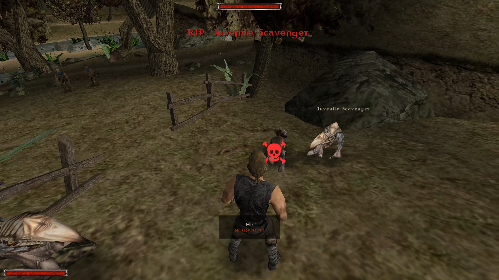
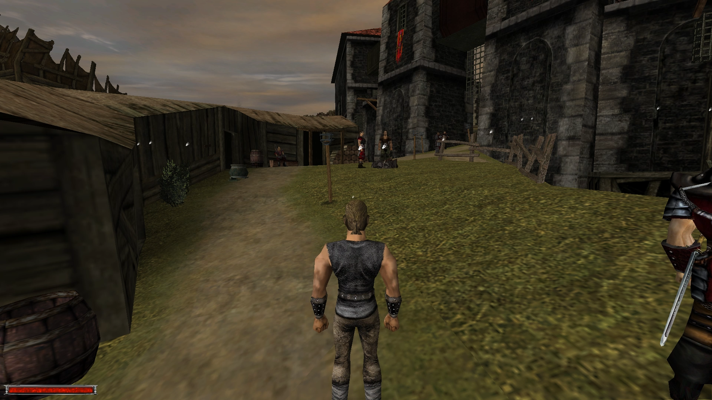

# Features
### TLDR Version
### No NPC steals your XP without you realizing ever again

### You won't forget to beat up an NPC


Additional showcase videos can be found in the playlist [here](https://www.youtube.com/playlist?list=PLZRX_6sT4MzlLyzBTLnNPSoPWPW7Dlj2K).


# How to install the pre-built plugin
1. Have [Ninja](https://github.com/szapp/Ninja) installed.
2. Drop `MaxXPHelper.vdf` file into `<gothic-main-dir>/Data`

# Death Alerts: 
Shows a text alert if XP is lost when NPC dies ([showcase video](https://youtu.be/C4gkmvgOq8g)), following the below rules:
- NPC got killed by non-party-member NPC and XP haven't been received before (or `considerG1DoubleXPGlitch=1` in which case player must finish everyone off with a bow or magic);
- NPC got killed by game scripts (B_KillNpc/B_RemoveNpc) and player **could** have beaten them but hadn't, which is: 
    - NPC wasn't immortal just before getting killed/removed;
    - NPC death wasn't scripted in a way that player couldn't have done anything about it. For example: 
        - Carristo's death in Gothic 1 CH4 is ignored, however death of other fire magicians won't be ([showcase video](https://youtu.be/y2wn8b_o3VU)); 
        - Stone guardians next to the Jharkendar portal in G2 NotR which get killed by a script run on the first visit are ignored, however, deaths of any remaining guardians after Raven is defeated won't be; 
    
        A lot of G2 NotR deaths cannot be detected in any other way than by having a list of such NPCs. In case the one shipped by default is incorrect or non-exhaustive, it can be easily overriden. 
        
        Plugin expects the blacklist to be provided in a file located at a path from `deadOnArrivalNPCListPath` config option (default `system\maxxphelper_deadOnArrivalNPCList.txt`). This should be just a single line of semicolon separated list of NPC instance names (i.e. what you type in `insert vob <code>` console command to spawn an npc). The file should end with a semicolon folowed by a newline (because of "reasons").
    - [`considerG1DoubleXPGlitch=1` only] Player or party member killed NPC with melee finisher ([showcase video](https://youtu.be/dADHo9kF3O0));
    - [`considerG1DoubleXPGlitch=1` only] Player or party member killed NPC without beating them up first;
    - [`considerLevelZeroNPC=0`] Level 0 NPCs are ignored (they give no XP with vanilla game's formula - `npc_level * 10`);

In addition, a failure tracker can be displayed at the position of the NPC which triggered the alert (`showTrackerOnDeathAlert=1`).

### Future enhancements ideas
- inverse mode for `considerG1DoubleXPGlitch` that is - warn player if they receive double XP and they don't want to

# XP NPC Locator: 
**Usage**: press a key configured by `toggleXPNPCLocatorKey` ini option (by default `V`) to toggle rendering on and off.

Draws trackers at position of NPCs which hero can still beat up to gain more XP ([showcase video](https://youtu.be/Gu6wjjwf4C4)).
- Filters out NPCs with immortality flag set;
- Takes `considerG1DoubleXPGlitch` into account (if NPC was beaten before, tracker will display an icon suggesting a ranged kill);
- Takes `considerLevelZeroNPC` into account;

### How it works
You can read the source of `XP_NPC_LOCATOR.D` to understand this in detail. 

In short: nearby NPCs (whose AI is processed by game) are always updated & rendered on every frame. 

Inactive NPCs (whose AI is frozen) are **incrementally** processed (couple NPCs every frame)so it doesn't impact framerate too much. 
NPCs are divided into "buckets" based on their distance to the Hero. Only first few buckets (representing NPCs closest to the player) are rendered, other buckets are skipped. 

It would be possible to render all NPCs but this would likely lower framerate too much and cause significant visual clutter. The primary purpose of this feature is to show player if they forgot about a monster or two while clearing an area and, if so, point to the nearest one. Rendering everything, especially at the start of the game, makes very little sense.
    
# Thief Scanner
Enabled with `considerPickpocketing=1` ini option. Videos showcasing the feature are [here](https://youtu.be/HmdfoVVA32E), [here](https://youtu.be/VoiYJIP8H-I) and [here](https://youtu.be/Rfctm-ixfj0).

This integrates with XPNPCLocator to display a pickpocket tracker if NPC hasn't been pickpocketed yet (and is possible to). Color of the tracker depends on whether dexterity requirements are met or not. For some edge cases, it's not possible to tell (at least using the approach I chose) so there're 3 colors in total - `pickpocketSeemsEnoughDexColor`, `pickpocketSeemsNotEnoughDexColor` and `pickpocketIndeterminableColor`.

In addition, pickpocketable NPCs are continuously scanned and a text alert (similar to DeathAlerts) will pop up when NPC can no longer be pickpocketed which could happen if:
- NPC died
- pickpocket dialogue choice become permanently unavailable. This **should** work in cases like item is looted or Ehnim no longer can be talked to. Likely, this is not 100% bulletproof though. You can read [this](/THIEF_SCANNER.md) if you want more details how this insanity works under the hood.

Some NPCs are never pickpocketable (no way to start a dialogue, like Skinner, or bugged, like Edda). To ignore those NPCs use `pickpocketBlacklist` ini option. By default it's set to:
```
VLK_491_Vanja;VLK_471_Edda;BDT_1082_Addon_Skinner;VLK_436_Sonja;VLK_4201_Wirt;
```
which should be accurate for a mercenary/dragon hunter playthrough.

# Gothic.ini options explained
After installing, start a new game or load a save to get the defaults auto-set in `system/Gothic.ini` file. The section is called `[MaxXPHelper-V1]`. No UI available, sorry, I can't be bothered. Most defaults should be good enough so no need to go through all of the below.

```
[MAXXPHELPER-V1]
; ... Key constant name (as defined in Ikarus https://github.com/Lehona/Ikarus/blob/a7bcd2b19ab3ba05b8d4c6e8068f8c3cae9540a2/Ikarus_Const_G1.d#L181) which toggles XPNPCLocator trackers.
; ... Value is NOT persisted and trackers need to be toggled every time game loads.
toggleXPNPCLocatorKey=KEY_V
; ... Should scripts consider double XP exploit from Gothic 1 (1 - on, 0 - off, default - off); It makes very little sense to set it on if not playing Gothic 1.
considerG1DoubleXPGlitch=1
; ... Should all script features ignore NPCs at level 0 (like Mud or self-summoned creatures like G2 NotR); 1 - on, 0 - off, default - off, such NPCs don't yield XP in the vanilla game anyway.
considerLevelZeroNPC=0
; ... Should NPC death alerts be displayed. 1 - on, 0 - off.
showDeathAlerts=1
; ... Semicolon separated list of NPC instance names to ignore if they got killed by game scripts (rather than usual gameplay) because they are effectively... "dead on (player's) arrival". 
; ... Path to the file from which the script should read deadOnArrivalNPCList (see section below for defaults.)
deadOnArrivalNPCListPath=system\maxxphelper_deadOnArrivalNPCList.txt
; ... Easter egg, you can disable this by setting to an empty string.
deathAlertsSVM=
; ... Whether trackers should use z buffer (depth buffer) i.e. be occluded by objects in front or not (be drawn on top of everything). 1 - on, 0 - off, default - off.
trackersUseZBuffer=0
; ... Key constant name to toggle `trackersUseZBuffer` option, not set by default.
toggleTrackersUseZBufferKeyCode=
; ... How many "buckets" of trackers should be rendered at most. XPNPCLocator sorts inactive (far) NPCs into "buckets" based on the distance from the hero.
; ... Maximum is hardcoded to 100, if set at that value, all trackers are display. Recommend not to increase this or performance will drop.
trackersRenderingLevel=2
; ... Key constant name for toggling max rendering level (100) on and off, not set by default (because it hurts performance a lot), value NOT persisted.
toggleTrackersMaxRenderingLevelKey=
; ... Whether to display a tracker at NPC death location when death alert is triggered.  1 - on, 0 - off, default - on.
showTrackerOnDeathAlert=1
; ... How long death alert tracker is displayed before it auto expires.
deathAlertTrackerDurationInMillis=5000
; ... How long death alert text notification is displayed before it auto expires.
deathAlertTextDurationInMillis=5000
; ... Hex string (RBG) of a color for death alert text notifications & trackers. Default is red #FF3232.
deathAlertsFailColor=#FF3232
; ... Hex string (RBG) of a color for system notifications (i.e. when XPNPCLocator is toggled). Default is green #32FF32.
systemNotificationsColor=#32FF32
; ... Enables thief scanner,  1 - on, 0 - off, default - on in Gothic 2.
considerPickpocketing=1
; ... Color of the text alert if thief scanner determined NPC to become not-pickpocketable.
pickpocketAlertsWarningColor=#FF5F15
; ... Color of XPNPCLocator pickpocket tracker when thief scanner thinks pickpocketing attempt will succeed.
pickpocketSeemsEnoughDexColor=#32FF32
; ... Color of XPNPCLocator pickpocket tracker when thief scanner thinks pickpocketing attempt will fail.
pickpocketSeemsNotEnoughDexColor=#FF3232
; ... Color of XPNPCLocator pickpocket tracker when thief scanner cannot determine if pickpocketing will succeed or is currently unavailable (NPC doesn't have the item yet etc).
pickpocketIndeterminableColor=#FF5F15
; ... Color of XPNPCLocator tracker if NPC is hostile towards player (like monster).
locatorHostileNPCColor=#FF3232
; ... How long system notifications (i.e. when XPNPCLocator is toggled) are displayed.
locatorIconSize=50
; ... XPNPCLocator trackers size.
systemNotificationDurationInMillis=2000
; ... Color of XPNPCLocator tracker if NPC is not hostile towards player (like Khorinis citizen).
locatorNonHostileNPCColor=#FFFFFF
; ... list of NPC instances to be ignored by Thief Scanner.
pickpocketBlacklist=A;B;C;
```
### Dead on arrival defaults
Following is the default for Gothic 2 NotR. I extracted this by running a script located at `tools/g2notr_print_doa_npcs.py` against the scripts from [here](https://github.com/IDizor/GothicScripts). For Gothic 1 its empty as there're no cases where a seemingly normal NPC gets killed off-screen by game's scripts pretty much the first time player arrives in new location. **Note:** this must be terminated by a semicolon and end with a new line.
```
VLK_4304_Addon_William;Stoneguardian_MineDead4;;VLK_4103_Waffenknecht;YGiant_Bug_VinoRitual1;PAL_297_Ritter;VLK_Leiche1;STRF_Leiche2;NOV_653_ToterNovize;Stoneguardian_MineDead2;STRF_1143_Addon_Sklave;NONE_Addon_114_Lance_ADW;STRF_1132_Addon_Sklave;DJG_731_ToterDrachenjaeger;VLK_4105_Waffenknecht;NOV_656_ToterNovize;YGiant_Bug_VinoRitual2;PAL_Leiche4;Stoneguardian_Dead3;STRF_1141_Addon_Sklave;STRF_Leiche7;STRF_1135_Addon_Sklave;Stoneguardian_MineDead3;PIR_1370_Addon_Angus;BDT_10401_Addon_DeadBandit;VLK_4147_Waffenknecht;STRF_Leiche8;DJG_738_ToterDrachenjaeger;DJG_730_ToterDrachenjaeger;NOV_654_ToterNovize;STRF_1142_Addon_Sklave;NOV_652_ToterNovize;VLK_Leiche2;VLK_4145_Waffenknecht;PIR_1371_Addon_Hank;Stoneguardian_Dead1;PAL_Leiche5;STRF_1144_Addon_Sklave;DJG_740_ToterDrachenjaeger;STRF_1131_Addon_Sklave;STRF_Leiche5;VLK_Leiche3;STRF_1134_Addon_Sklave;Stoneguardian_MineDead1;Bruder;DJG_739_ToterDrachenjaeger;STRF_Leiche3;VLK_4152_Olav;STRF_Leiche4;DJG_737_ToterDrachenjaeger;NOV_655_ToterNovize;PAL_298_Ritter;VLK_4104_Waffenknecht;DJG_735_ToterDrachenjaeger;STRF_Leiche1;STRF_Leiche6;Stoneguardian_Dead2;NOV_650_ToterNovize;DJG_734_ToterDrachenjaeger;BDT_10400_Addon_DeadBandit;VLK_4101_Waffenknecht;VLK_4102_Waffenknecht;PAL_Leiche3;DJG_732_ToterDrachenjaeger;PAL_Leiche1;VLK_4146_Waffenknecht;DJG_733_ToterDrachenjaeger;PAL_Leiche2;NOV_651_ToterNovize;DJG_736_ToterDrachenjaeger;STRF_1133_Addon_Sklave;
```
# Known Issues 
- [`considerG1DoubleXPGlitch=1`][Death Alerts] Killing NPC too fast after they got up from unconscious may not detect lost XP
- [XPNPCLocator] some trackers may appear at invalid locations (often happens NPC routine changes and they are despawned)
- [XPNPCLocator] transforming into a monster and then back may add an invalid tracker at the location


# Build Instructions
## First time set up
1. Get GothicVDFS tool (if you have Steam version of Gothic 2 then GothicVDFS 2.5 can be found at `<steam gothic 2 install dir>\_work\tools\VDFS`)
2. Run `.\build.bat` once to get `dot.env` file created in the repo root and set:
    - `GOTHIC_VDFS_PATH` var to `GothicVDFS.exe` path
    - [Optional] set `SEMICOLON_SEPARATED_EXTRA_OUTPUT_PATHS` to your Gothic/Gothic 2 Data folder
## Actual building
Assuming `GOTHIC_VDFS_PATH` is set and your working directory is the repo root - run `.\build.bat`. `MaxXPHelper.vdf` will be at `.\build\` and paths set in `SEMICOLON_SEPARATED_EXTRA_OUTPUT_PATHS` variable

# XPNPCLocator Performance Notes

Framerate will suffer with the locator enabled, especially if max rendering level (toggled by pressing key set at `toggleTrackersMaxRenderingLevelKey`) is on or in crowded areas such as Khorinis. At the current state, optimizing the performance further would require significant effort which is probabably not worth it. The use case for this feature is not to run around the map with locator being constantly on. It's only supposed to help track down any missing monsters/pickpocket opportunities. 

Potential improvements which come to my mind are:
- transform vertices on GPU (vertex shader?) instead of CPU for more parallelism, faster floating point arithmetics and shorter time when main game's thread is blocked; 
    Note: I'm no 3D Graphics expert but I believe game uses an old DirectX 7 renderer so doing the above in a way that leaves the plugin compatible with both vanilla game and custom renderers (GD3D11) might be tough;
- batch the draw calls to DirectX device (draw primitive indexed or similar, not sure if it's even available with DX7);
- use a BSP Tree and do the frustum culling properly so not all trackers are iterated each frame (which is slow if there's a lot of them active); alternatively - turn trackers into actual VOBs and have game engine do it...
- Process NPCs on a separate thread; This would require a rewrite to Union and C++ as calling Daedelus scripts from separate thread is not a feasible solution; Also I doubt this particular enhancement will make a dramatic difference;

I believe none of the above are low hanging fruits and I have no time to explore the above so sorry, it'll run like crap :(.

# Attributions
The following CC0 License icons are used (some with slightl modifications):
- https://www.svgrepo.com/svg/307071/punch-fist-hit?edit=true
- https://www.svgrepo.com/svg/308871/skull-and-bones-deadly-skull-bones
- https://www.svgrepo.com/svg/254407/money-bag-money
- https://www.svgrepo.com/svg/307146/theft-crime-steal-thief
- https://www.svgrepo.com/svg/308893/sword-conflict-war-violence